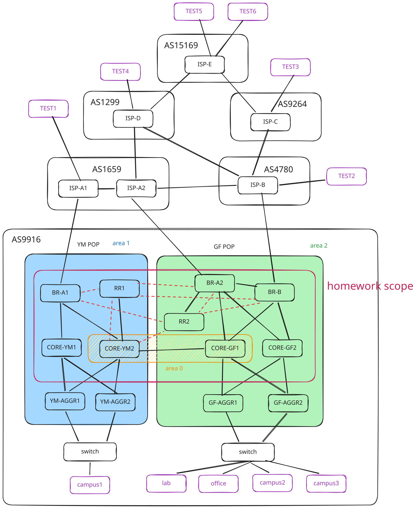

# HW1

## 1. Objective

Build and configure the NYCU network, AS9916, shown in the topology to satisfy the required IGP paths, BGP import and export policies, ECMP behavior, and failover behavior described in this document.

Your final network must meet the required end-to-end traffic behavior under both normal operation and the specified failure scenarios.
> [!NOTE]
> You can find the instruction of how to try on the online judge in Secion 2.7

## 2. Reference Topology and Design

Interactive topology diagram: <https://topo.nnie.tw/#/hw1>



HW1 covers only the red area marked in `topo.svg`.

The topology outside AS9916 is provided only as a reference to help you test connectivity. The real topology may contain additional nodes.

### 2.1 NYCU Network

AS9916 is split across two POPs:

- YM POP (area 1): `BR-A1`, `RR1`, `CORE-YM1`, `CORE-YM2`, `YM-AGGR1`, `YM-AGGR2`
- GF POP (area 2): `BR-A2`, `BR-B`, `RR2`, `CORE-GF1`, `CORE-GF2`, `GF-AGGR1`, `GF-AGGR2`
- Backbone (area 0): the inter-POP link between `CORE-YM2` and `CORE-GF1`

### 2.2 External ASes

The NYCU network connects to the following external autonomous systems:

- `ISP_A`: AS1659 (TANet)
- `ISP_B`: AS4780 (SeedNet)
- `ISP_C`: AS9264 (Sinica)
- `ISP_D`: AS1299 (Arelion)
- `ISP_E`: AS15169 (Google)

For this lab, interpret the external AS topology using the following relationship model:

- `ISP_B` and `ISP_D` are the top-level external providers in this lab.
- `ISP_A` consists of `ISP-A1` and `ISP-A2`; the `ISP-A1` <-> `ISP-A2` link is internal connectivity inside AS1659.
- `ISP_A` and `ISP_B` are upstream providers for AS9916.
- `ISP_B` and `ISP_D` are upstream providers for `ISP_A`.
- `ISP_B` is the upstream provider for `ISP_C`.
- `ISP_C` and `ISP_D` are upstream providers for `ISP_E`.

Use this relationship model when interpreting BGP export communities and path preferences. Downstream routes should not be leaked to unrelated upstream neighbors unless the policy explicitly allows it.

The external edge links visible in the topology are:

- `BR-A1` <-> `ISP-A1`
- `BR-A2` <-> `ISP-A2`
- `BR-B` <-> `ISP-B`

### 2.3 Networks Shown in the Diagram

The topology includes the following NYCU destination networks:

- lab: `120.126.100.0/24`
- office: `140.129.80.0/24`
- campus aggregate: `140.113.0.0/16`
  - loopbacks: `140.113.0.0/24`
  - internal peer links: `140.113.255.0/24`
  - campus1: `140.113.1.0/24`
  - campus2: `140.113.2.0/24`
  - campus3: `140.113.3.0/24`

Reference external test networks:

- `TEST1`: AS1659, `163.16.0.0/13`
- `TEST2`: AS4780, `42.0.64.2/18`
- `TEST3`: AS9264, `103.130.252.0/22`
- `TEST4`: AS1299, `2.255.248.0/21`
- `TEST5`: AS15169, `8.8.8.0/24`

### 2.4 Intra-Domain Routing

Use OSPF inside AS9916 and organize it according to the topology:

- area 1: YM POP
- area 2: GF POP
- area 0: the inter-POP backbone between `CORE-YM2` and `CORE-GF1`

Tune OSPF metrics so that the required routing behavior in Section 4 is achieved.

### 2.5 External BGP

Configure eBGP sessions on the NYCU border routers:

- `BR-A1` with `ISP-A1` in AS1659
- `BR-A2` with `ISP-A2` in AS1659
- `BR-B` with `ISP-B` in AS4780

The ISPs accept only the following prefixes:

- `140.129.80.0/24` (office)
- `120.126.100.0/24` (lab)
- `140.113.0.0/16-24` (campus)

Configure the following prefix limits. Exceeding the prefix limit tears down the BGP session.

- `ISP-A1` receives at most 3 prefixes from `BR-A1`.
- `ISP-A2` receives at most 3 prefixes from `BR-A2`.
- `ISP-B` receives at most 3 prefixes from `BR-B`.

Communities to use:

- Large-community format: `large:AS1:action:AS2`
- `AS1:0` (encoded as `large:AS1:0:0`): prevent `AS1` from announcing the tagged prefix to any external neighbor
- `AS1:0:AS2`: prevent `AS1` from announcing the tagged prefix to neighbor `AS2`
- `AS1:1:AS2`: announce the tagged prefix to neighbor `AS2`
- `AS1:101:AS2`: prepend `AS1` once when announcing the tagged prefix to neighbor `AS2`
- `AS1:102:AS2`: prepend `AS1` twice when announcing the tagged prefix to neighbor `AS2`
- `AS1:103:AS2`: prepend `AS1` three times when announcing the tagged prefix to neighbor `AS2`

### 2.6 Internal BGP

Distribute external reachability across AS9916 using iBGP.

- `RR1` and `RR2` act as route reflectors.
- Red dotted lines in the topology indicate the expected iBGP sessions.
- Use loopback peering for iBGP.
- Use the physical links only for OSPF.

### 2.7 OJ Workflow, Access, and Debugging

The lab provides both Junos routers and Linux hosts for testing and diagnosis.

Submit and grade this homework through <https://oj.nnie.tw/>.

Recommended OJ workflow:

> [!NOTE]
> You can find below operation in `Sidebar` -> `Tools`
1. Run the `Assign SSH Host` tool to allocate your persistent VM.
2. Run the `Setup Proxy` tool to generate your SSH key and authorize proxy access to the assigned VM.
3. Run the `HW1 Setup` tool to deploy or redeploy the HW1 topology on the assigned VM.
4. If ECMP behavior looks wrong after container restarts or manual debugging, run the `HW1 Init Sysctl` tool to reapply and verify the Linux sysctl settings.
5. Submit to the `Homework 1` problem to grade your current configuration.

Assigned VM:

- The VM assigned by `Assign SSH Host` is your working environment for HW1.
- Use the SSH/proxy instructions produced by `Setup Proxy` to connect to the assigned VM.
- Run `HW1 Setup` again whenever you need to redeploy the HW1 topology from a clean scaffold.
- Run `HW1 Init Sysctl` when ECMP tests or traceroutes look unstable after container restarts; it reruns `/tmp/init.sh` across the existing `hw1` topology and verifies the sysctl state without redeploying.

Files and persistence:

- Initial router configuration files are mounted into the `jump` host at `/opt/configs/` read-only.
- The `jump` host has writable persistent storage at `/opt/jump-host-data/`.
- Use `/opt/jump-host-data/` for notes, temporary scripts, logs, and other data that should survive topology redeploys when needed.
- Do not use `/opt/configs/` as writable working storage.

Linux hosts:

- `jump`, `campus1`, `lab`, `office`, `campus2`, `campus3`, and `test1`-`test5` are Linux nodes using the `nnie-linux` image.
- The Linux image includes common debugging tools such as `mtr`, `traceroute`, `etr`, `ping`, `ip`, `ssh`, and `tmux`.
- Endpoint and external test traffic should usually be verified from these Linux hosts.

Junos routers:

- Junos routers can use `traceroute` for path diagnosis.
- Typical router-side checks include `show route`, `show ospf route`, `show bgp summary`, and `traceroute`.

Login roles:

- HW1-scope routers in AS9916 use login user `user` with `super-user` privileges.
- Out-of-scope external routers use login user `user` with `operator` privileges for diagnosis.

Jump host:

- A Linux node named `jump` is provided as a convenient SSH jump host.
- SSH client config is mounted into the container.
- `tmux` is available for multiple persistent shells or split panes during debugging.

Example workflow:

```bash
ssh user@jump
ssh user@br-a1
```

```bash
ssh user@jump
ssh user@campus1
mtr --tcp --port 80 8.8.8.8
```

```text
user@br-a1> traceroute 8.8.8.8
user@br-a1> show route 8.8.8.0/24 extensive
```

## 3. High-Level Routing Policy Goals

### 3.1 Outbound Policy from AS9916

Outbound traffic from the NYCU network must use both `ISP_A` and `ISP_B`.

This implies the following:

- AS9916 must not behave as a single-homed network.
- Internal routing and BGP path selection must leave usable exits through both the `ISP_A` side and the `ISP_B` side.
- Exit selection must follow the traffic-engineering goals in Section 4.
- Traffic destined for `ISP_E` should prefer the `ISP_B` path and should use `ISP_A` only if the `ISP_B` path is unavailable.

### 3.2 Inbound Policy toward AS9916

Engineer inbound traffic so that it satisfies the following rules:

1. Traffic originating from `ISP_B` and `ISP_C` must enter AS9916 through `ISP_B` to `BR-B`.
2. Traffic destined for the office prefix must enter AS9916 through `ISP_B` to `BR-B`.
3. Other inbound traffic should prefer `ISP_A`.

These policies may be implemented using any standard BGP mechanisms supported by the platform, including selective advertisement, more-specific advertisements, MED, AS-path prepending, communities, or equivalent policy controls.

## 4. Required Routing Behavior

### 4.1 Inside AS9916

#### Core to Aggregation

- Core-to-aggregation forwarding must support ECMP.
- Where equal-cost internal paths exist from the core toward the aggregation layer, both paths should be usable.
- From a user LAN, traffic should use ECMP across the two local AGGR-to-core uplinks when both local cores are available.
- Probe examples that must show aggregation ECMP:
  - `campus1 -> lab`: flows should use both `GF-AGGR1` and `GF-AGGR2` before reaching `lab`.
  - `office -> campus1`: flows should use both `YM-AGGR1` and `YM-AGGR2` before reaching `campus1`.
  - `campus3 -> campus1`: flows should use both `YM-AGGR1` and `YM-AGGR2` before reaching `campus1`.

#### YM POP Behavior

Within the YM POP:

- Traffic from the core toward the `ISP_A` side should prefer `BR-A1`.
- Traffic sourced from a YM user LAN should use ECMP across `YM-AGGR -> CORE-YM1` and `YM-AGGR -> CORE-YM2` when both are healthy.
- When traffic has already entered the YM POP through `BR-A1` and is destined to a YM user LAN, it should prefer the non-backbone core `CORE-YM1` before reaching the YM aggregation pair.
- When traffic has already entered the YM POP through `BR-A1` and is destined to the GF POP, it should prefer the backbone-side core `CORE-YM2` so it crosses the inter-POP backbone through `CORE-GF1`.
- Traffic from the YM side that ultimately exits through `ISP_B` should cross the backbone through the GF side (`CORE-YM2 -> CORE-GF1 -> BR-B`) rather than attempting to leave locally.
- Probe examples:
  - `campus1 -> TEST1`: traffic should stay on the YM side, exit through `BR-A1 -> ISP-A1`, and should not traverse the inter-POP backbone or `BR-B`.
  - `TEST1 -> campus1`: traffic should enter through `BR-A1`, prefer `CORE-YM1`, and use both `YM-AGGR1` and `YM-AGGR2` before reaching `campus1`.

#### GF POP Behavior

Within the GF POP:

- Traffic sourced from a GF user LAN should use ECMP across `GF-AGGR -> CORE-GF1` and `GF-AGGR -> CORE-GF2` when both are healthy.
- When traffic has already entered the GF POP through `BR-A2` or `BR-B` and is destined to a GF user LAN, it should prefer the non-backbone core `CORE-GF2` before reaching the GF aggregation pair.
- When traffic has already entered the GF POP through `BR-A2` or `BR-B` and is destined to the YM POP, it should prefer the backbone-side core `CORE-GF1` so it crosses the inter-POP backbone through `CORE-YM2`.
- Traffic from the GF border routers toward the campus side should traverse `CORE-GF1 -> CORE-YM2 -> campus`.
- Probe examples:
  - `campus2 -> TEST1`: traffic should exit through `BR-A2` toward `ISP_A`.
  - `campus2 -> TEST2`: traffic should exit through `BR-B` toward `ISP_B`.
  - `TEST2 -> campus2`: traffic should enter through `BR-B`, prefer `CORE-GF2`, and use both `GF-AGGR1` and `GF-AGGR2` before reaching `campus2`.

#### Internal Path Requirement

The required internal path between the campus1 side and the GF-side prefixes is:

- `campus1 -> CORE-YM2 -> CORE-GF1 -> others`
- `others -> CORE-GF1 -> CORE-YM2 -> campus1`

Concrete probe examples:

- `campus1 -> lab` should cross the backbone through `CORE-YM2 -> CORE-GF1` before reaching `lab`.
- `lab -> campus1` should cross the backbone through `CORE-GF1 -> CORE-YM2` before reaching `campus1`.

### 4.2 Required Normal-Operation Paths

Under normal operation, the following paths are required:

- Traffic to campus prefixes in the YM POP should enter through `ISP_A` to `BR-A1`.
  - `TEST4 -> campus1`: `TEST4 -> ISP-D -> ISP-A -> BR-A1 -> CORE-YM1 -> YM-AGGR -> campus1`
- Traffic to campus prefixes in the GF POP should enter through `ISP_A` to `BR-A2`.
  - `TEST4 -> campus2`: `TEST4 -> ISP-D -> ISP-A -> BR-A2 -> CORE-GF2 -> GF-AGGR -> campus2`
- Traffic to the lab prefix should use BGP ECMP through both `ISP_A` to `BR-A1` and `ISP_B` to `BR-B`.
  - `TEST4 -> lab`: `TEST4 -> ISP-D -> ISP-A -> BR-A1 -> CORE-YM2 -> CORE-GF1 -> GF-AGGR -> lab`
  - `TEST4 -> lab`: `TEST4 -> ISP-D -> ISP-B -> BR-B -> CORE-GF2 -> GF-AGGR -> lab`
- Traffic to the office prefix should enter through `ISP_B` to `BR-B`.
  - `TEST4 -> office`: `TEST4 -> ISP-D -> ISP-B -> BR-B -> CORE-GF2 -> GF-AGGR -> office`
- Traffic from `ISP_C` to AS9916 should enter through `ISP_B` to `BR-B`.
  - `TEST3 -> lab`: `TEST3 -> ISP-C -> ISP-B -> BR-B -> CORE-GF2 -> GF-AGGR -> lab`
- Traffic from AS9916 to `ISP_C` should exit through `BR-B` to `ISP_B`.
  - `campus1 -> TEST3`: `campus1 -> YM-AGGR -> CORE-YM2 -> CORE-GF1 -> BR-B -> ISP-B -> ISP-C -> TEST3`
- Traffic from AS9916 to `ISP_E` should prefer to exit through `BR-B` to `ISP_B`.
  - `campus1 -> TEST5`: `campus1 -> YM-AGGR -> CORE-YM2 -> CORE-GF1 -> BR-B -> ISP-B -> ISP-C -> ISP-E -> TEST5`
  - `lab -> TEST5`: `lab -> GF-AGGR -> CORE-GF -> BR-B -> ISP-B -> ISP-C -> ISP-E -> TEST5`

### 4.3 Required Failure Behavior

#### 4.3.1 Failure of `ISP-A1 <-> BR-A1`

All prefixes in AS9916 should remain reachable through `ISP-A2 -> BR-A2` and `ISP-B -> BR-B`.

The surviving traffic for the YM-side campus prefix should fail over through the remaining `ISP_A` side.

- `TEST4 -> campus1` should remain reachable.
- `TEST4 -> campus2` should remain reachable.
- `TEST4 -> campus3` should remain reachable.
- `TEST4 -> lab` should remain reachable.
- `TEST4 -> office` should remain reachable.
- `ISP-A1 -> campus1` should use the internal `ISP_A` path through `ISP-A2`, then enter AS9916 through `BR-A2`.
- `TEST4 -> lab` should continue to use ECMP through both `BR-A2` and `BR-B`; it should not traverse the failed YM-side `BR-A1` path or the `CORE-YM2 -> CORE-GF1` backbone sequence.

#### 4.3.2 Failure of `ISP-A2 <-> BR-A2`

All prefixes in AS9916 should remain reachable through `ISP-A1 -> BR-A1` and `ISP-B -> BR-B`.

The surviving traffic for the lab prefix should fail over through the remaining `ISP_A` side.

- `TEST4 -> campus1` should remain reachable.
- `TEST4 -> campus2` should remain reachable.
- `TEST4 -> campus3` should remain reachable.
- `TEST4 -> lab` should remain reachable.
- `TEST4 -> office` should remain reachable.
- `ISP-A2 -> lab` should use the internal `ISP_A` path through `ISP-A1`, then enter AS9916 through `BR-A1`.

#### 4.3.3 Failure of `ISP-B <-> BR-B`

- The office prefix should become unreachable.
- Traffic from `ISP_C` to AS9916 should become unreachable.
  - `TEST3 -> lab` should fail while the `ISP-B <-> BR-B` link is unavailable.
- All other traffic should remain unaffected.
- Traffic from AS9916 to `ISP_E` should fail over to the `ISP_A` side.
  - `campus1 -> TEST5`: `campus1 -> YM-AGGR -> CORE-YM -> BR-A1 -> ISP-A -> ISP-D -> ISP-E -> TEST5`
  - `lab -> TEST5`: `lab -> GF-AGGR -> CORE-GF -> BR-A2 -> ISP-A -> ISP-D -> ISP-E -> TEST5`

## 5. Pre-Configurations

All loopbacks are `/32`.

All internal point-to-point links are `/30`.

For the provided containerlab scaffold:

- `YM-SW` and `GF-SW` are bridge nodes running in container namespace mode.
- Host-facing ports are untagged access ports.
- Aggregation-facing ports are ordinary shared LAN connections.
- Each user LAN uses a VRRP VIP as its default gateway.

### 5.1 AS9916 Router Loopbacks (140.113.0.0/24)

| Router | lo0 |
|---|---|
| BR-A1 | `140.113.0.1/32` |
| RR1 | `140.113.0.11/32` |
| CORE-YM1 | `140.113.0.21/32` |
| CORE-YM2 | `140.113.0.22/32` |
| YM-AGGR1 | `140.113.0.31/32` |
| YM-AGGR2 | `140.113.0.32/32` |
| BR-A2 | `140.113.0.101/32` |
| BR-B | `140.113.0.102/32` |
| RR2 | `140.113.0.111/32` |
| CORE-GF1 | `140.113.0.121/32` |
| CORE-GF2 | `140.113.0.122/32` |
| GF-AGGR1 | `140.113.0.131/32` |
| GF-AGGR2 | `140.113.0.132/32` |

### 5.2 AS9916 Peer-Link Plan (140.113.255.0/24)

#### Area 1 (YM POP)

| Link | Subnet | Left IP | Right IP |
|---|---|---|---|
| BR-A1 <-> CORE-YM1 | `140.113.255.0/30` | BR-A1 `140.113.255.1` | CORE-YM1 `140.113.255.2` |
| BR-A1 <-> CORE-YM2 | `140.113.255.4/30` | BR-A1 `140.113.255.5` | CORE-YM2 `140.113.255.6` |
| RR1 <-> CORE-YM2 | `140.113.255.8/30` | RR1 `140.113.255.9` | CORE-YM2 `140.113.255.10` |
| CORE-YM1 <-> YM-AGGR1 | `140.113.255.12/30` | CORE-YM1 `140.113.255.13` | YM-AGGR1 `140.113.255.14` |
| CORE-YM1 <-> YM-AGGR2 | `140.113.255.16/30` | CORE-YM1 `140.113.255.17` | YM-AGGR2 `140.113.255.18` |
| CORE-YM2 <-> YM-AGGR1 | `140.113.255.20/30` | CORE-YM2 `140.113.255.21` | YM-AGGR1 `140.113.255.22` |
| CORE-YM2 <-> YM-AGGR2 | `140.113.255.24/30` | CORE-YM2 `140.113.255.25` | YM-AGGR2 `140.113.255.26` |

#### Area 0 Backbone

| Link | Subnet | Left IP | Right IP |
|---|---|---|---|
| CORE-YM2 <-> CORE-GF1 | `140.113.255.28/30` | CORE-YM2 `140.113.255.29` | CORE-GF1 `140.113.255.30` |

#### Area 2 (GF POP)

| Link | Subnet | Left IP | Right IP |
|---|---|---|---|
| BR-A2 <-> RR2 | `140.113.255.32/30` | BR-A2 `140.113.255.33` | RR2 `140.113.255.34` |
| BR-A2 <-> BR-B | `140.113.255.36/30` | BR-A2 `140.113.255.37` | BR-B `140.113.255.38` |
| BR-A2 <-> CORE-GF1 | `140.113.255.40/30` | BR-A2 `140.113.255.41` | CORE-GF1 `140.113.255.42` |
| BR-A2 <-> CORE-GF2 | `140.113.255.44/30` | BR-A2 `140.113.255.45` | CORE-GF2 `140.113.255.46` |
| BR-B <-> CORE-GF1 | `140.113.255.48/30` | BR-B `140.113.255.49` | CORE-GF1 `140.113.255.50` |
| BR-B <-> CORE-GF2 | `140.113.255.52/30` | BR-B `140.113.255.53` | CORE-GF2 `140.113.255.54` |
| CORE-GF1 <-> GF-AGGR1 | `140.113.255.56/30` | CORE-GF1 `140.113.255.57` | GF-AGGR1 `140.113.255.58` |
| CORE-GF1 <-> GF-AGGR2 | `140.113.255.60/30` | CORE-GF1 `140.113.255.61` | GF-AGGR2 `140.113.255.62` |
| CORE-GF2 <-> GF-AGGR1 | `140.113.255.64/30` | CORE-GF2 `140.113.255.65` | GF-AGGR1 `140.113.255.66` |
| CORE-GF2 <-> GF-AGGR2 | `140.113.255.68/30` | CORE-GF2 `140.113.255.69` | GF-AGGR2 `140.113.255.70` |

### 5.3 AS9916 Edge eBGP Peer Addresses

| Link | Subnet | AS9916 Side | External Side | Remote AS |
|---|---|---|---|---|
| BR-A1 <-> ISP-A1 | `210.60.221.0/30` | BR-A1 `210.60.221.2` | A1 `210.60.221.1` | 1659 |
| BR-A2 <-> ISP-A2 | `210.60.221.4/30` | BR-A2 `210.60.221.6` | A2 `210.60.221.5` | 1659 |
| BR-B <-> ISP-B | `59.105.6.0/30` | BR-B `59.105.6.2` | B `59.105.6.1` | 4780 |

### 5.4 Access Switch and Shared-LAN Plan

| LAN | Switch | Host-Facing Mode | Aggregation-Facing Mode |
|---|---|---|---|
| campus1 | `YM-SW` | access | shared untagged LAN to `YM-AGGR1` and `YM-AGGR2` |
| lab / office / campus2 / campus3 | `GF-SW` | access | shared untagged LAN to `GF-AGGR1` and `GF-AGGR2` |

`YM-AGGR*` and `GF-AGGR*` should terminate these LANs on their switch-facing interfaces.

### 5.5 User-Facing Gateway IPs

Hosts should use the VRRP VIP as their default gateway.

Recommended host addressing: use low host addresses such as `.1/24` unless a specific test host IP is provided elsewhere.

| LAN | Prefix | Router 1 | Router 2 | VIP / Default Gateway |
|---|---|---|---|---|
| campus1 | `140.113.1.0/24` | YM-AGGR1 `140.113.1.1` | YM-AGGR2 `140.113.1.2` | `140.113.1.254` |
| lab | `120.126.100.0/24` | GF-AGGR1 `120.126.100.1` | GF-AGGR2 `120.126.100.2` | `120.126.100.254` |
| office | `140.129.80.0/24` | GF-AGGR1 `140.129.80.1` | GF-AGGR2 `140.129.80.2` | `140.129.80.254` |
| campus2 | `140.113.2.0/24` | GF-AGGR1 `140.113.2.1` | GF-AGGR2 `140.113.2.2` | `140.113.2.254` |
| campus3 | `140.113.3.0/24` | GF-AGGR1 `140.113.3.1` | GF-AGGR2 `140.113.3.2` | `140.113.3.254` |

### 5.6 External Routers

| Router | Loopback |
|---|---|
| ISP-A1 | `210.60.221.241/32` |
| ISP-A2 | `210.60.221.242/32` |
| ISP-B | `59.105.6.241/32` |
| ISP-C | `202.169.172.241/32` |
| ISP-D | `129.9.0.241/32` |
| ISP-E | `142.250.20.241/32` |

| Link | Subnet | Left IP | Right IP |
|---|---|---|---|
| ISP-A1 <-> ISP-A2 | `210.60.221.8/30` | A1 `210.60.221.9` | A2 `210.60.221.10` |
| ISP-A2 <-> ISP-D | `129.9.0.0/30` | A2 `129.9.0.2` | D `129.9.0.1` |
| ISP-B <-> ISP-A2 | `59.105.6.12/30` | B `59.105.6.13` | A2 `59.105.6.14` |
| ISP-B <-> ISP-C | `59.105.6.4/30` | B `59.105.6.5` | C `59.105.6.6` |
| ISP-B <-> ISP-D | `59.105.6.8/30` | B `59.105.6.9` | D `59.105.6.10` |
| ISP-C <-> ISP-E | `202.169.172.0/30` | C `202.169.172.1` | E `202.169.172.2` |
| ISP-D <-> ISP-E | `129.9.0.4/30` | D `129.9.0.5` | E `129.9.0.6` |

Test host IPs:

- `TEST1`: AS1659, `163.16.0.3/13`
- `TEST2`: AS4780, `42.0.64.2/18`
- `TEST3`: AS9264, `103.130.252.225/22`
- `TEST4`: AS1299, `2.255.248.1/21`
- `TEST5`: AS15169, `8.8.8.8/24`
