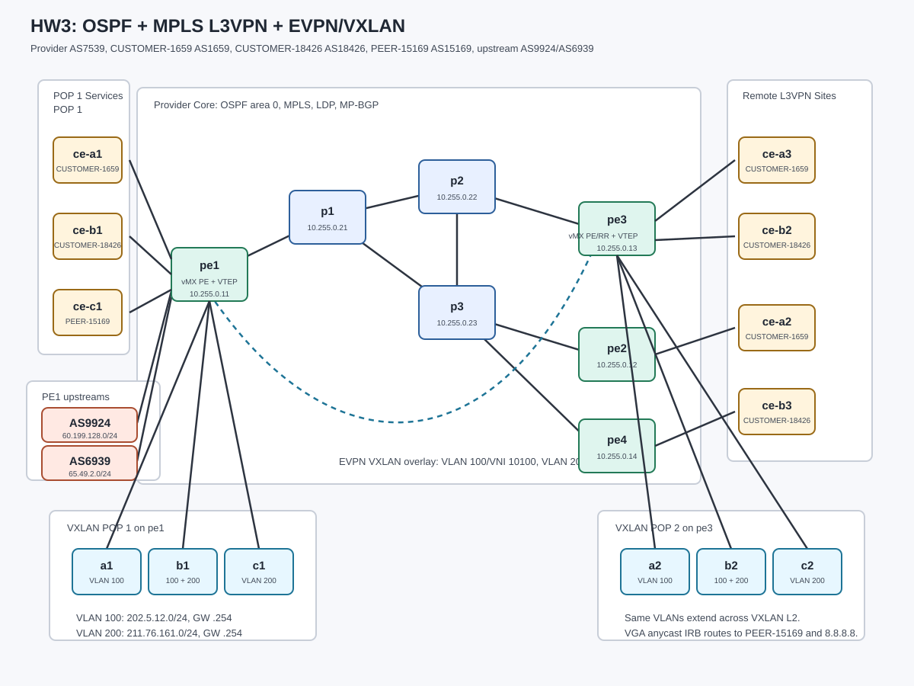

# HW3

## 1. Objective

Build and configure the HW3 provider network shown in the topology to satisfy the required OSPF underlay, MPLS transport, MPLS L3VPN services, controlled VPN route leaking, and EVPN/VXLAN L2 extension behavior described in this document.

The provider network is AS7539. The customer VPN ASNs are:

- `CUSTOMER-1659`: AS1659
- `CUSTOMER-18426`: AS18426
- `PEER-15169`: AS15169
- PE1 upstream transit peers: AS9924 and AS6939

Your final network must meet the required control-plane and end-to-end data-plane behavior for both the MPLS L3VPN services and the EVPN/VXLAN L2 services.

## 2. Reference Topology and Design



HW3 combines two course topics:

- Week 7 style service-provider MPLS L3VPN with OSPF, LDP, MP-BGP, VRFs, and route targets.
- Week 8 style EVPN/VXLAN L2 extension with two PE routers acting as VTEPs.

### 2.1 Provider Core

Provider routers:

- PEs: `pe1`, `pe2`, `pe3`, `pe4`
- P routers: `p1`, `p2`, `p3`

Container images:

- `pe1` and `pe3` use vMX (`juniper_vmx`) because they terminate EVPN/VXLAN IRB anycast gateways with `virtual-gateway-address`.
- `pe2`, `pe4`, P routers, CE routers, and upstream routers use cRPD (`juniper_crpd`).

Traffic model:

- All provider core links run OSPF area `0.0.0.0`.
- All provider core links run MPLS and LDP.
- PE loopbacks are advertised in OSPF and used as BGP next hops.
- P routers provide provider transport only. They do not run customer VRFs or EVPN instances.
- PE routers exchange `inet-vpn` routes using MP-BGP.

### 2.2 MPLS L3VPN Services

Customer attachment:

- `CUSTOMER-1659` AS1659:
  - `ce-a1` attaches to `pe1`
  - `ce-a2` attaches to `pe2`
  - `ce-a3` attaches to `pe3`
- `CUSTOMER-18426` AS18426:
  - `ce-b1` attaches to `pe1`
  - `ce-b2` attaches to `pe3`
  - `ce-b3` attaches to `pe4`
- `PEER-15169` AS15169:
  - `ce-c1` attaches to `pe1`
  - `host-c1` uses `8.8.8.8/24` to simulate Google DNS

All PE-CE routing in HW3 uses eBGP.

Because all sites in a given VPN use the same customer ASN, PEs must prevent AS loop rejection when advertising remote routes back to the customer. A valid solution is to use PE-side `as-override` for `CUSTOMER-1659` and `CUSTOMER-18426` PE-CE sessions.

L3VPN service intent:

- `CUSTOMER-1659` sites must reach each other.
- `CUSTOMER-18426` sites must reach each other.
- `PEER-15169` is a shared-services VRF hosted on `pe1`.
- `CUSTOMER-1659` and `PEER-15169` must exchange selected routes through explicit route-target based leaking.
- `CUSTOMER-1659` must receive PE1 upstream routes from AS6939.
- `CUSTOMER-18426` must receive PE1 upstream routes from AS9924.
- `CUSTOMER-1659` and `CUSTOMER-18426` must both exchange routes with `PEER-15169`.

PE1 upstream transit intent:

- `pe1` peers with AS9924 and AS6939 using eBGP.
- Routes from AS9924 and AS6939 must be kept in separate routing tables before leaking.
- The lab simulates full-table inputs with representative real-AS prefixes plus one unique more-specific test prefix per upstream:
  - AS9924: `60.199.0.0/16`, `61.30.0.0/16`, `61.31.0.0/16`, and `60.199.128.0/24`
  - AS6939: `64.62.128.0/17`, `65.49.0.0/17`, `65.19.128.0/18`, and `65.49.2.0/24`

### 2.3 EVPN/VXLAN L2 Services

`pe1` and `pe3` also act as VTEPs:

- POP 1 VTEP: `pe1`
- POP 2 VTEP: `pe3`

Customer VLAN policy:

- Host group `A` uses VLAN `100`.
- Host group `B` uses VLAN `100` and VLAN `200`.
- Host group `C` uses VLAN `200`.

VLAN to VNI mapping:

- VLAN `100` maps to VNI `10100`.
- VLAN `200` maps to VNI `10200`.

VXLAN IP prefixes:

- VLAN `100`: `202.5.12.0/24`
- VLAN `200`: `211.76.161.0/24`

EVPN/VXLAN intent:

- Same-VLAN hosts must reach each other across POPs through EVPN/VXLAN L2 extension.
- VLAN `100` and VLAN `200` must use an EVPN anycast gateway on `pe1` and `pe3`.
- The VXLAN prefixes must be reachable from shared-services `PEER-15169`, so VLAN `100` and VLAN `200` hosts can ping `8.8.8.8`.
- Same-VLAN host-to-host tests must prove L2 forwarding, not only routed reachability through the anycast gateway.
- VXLAN and MPLS L3VPN services must operate at the same time on `pe1` and `pe3`.

### 2.4 OJ Workflow, Access, and Debugging

Submit and grade this homework through <https://oj.nnie.tw/> when the HW3 problem is enabled.

Recommended OJ workflow:

1. Run the `Assign SSH Host` tool to allocate your persistent VM.
2. Run the `Setup Proxy` tool to generate your SSH key and authorize proxy access to the assigned VM.
3. Run the `HW3 Setup` tool to deploy or redeploy the HW3 topology on the assigned VM.
4. Submit to the `Homework 3` problem to grade your current configuration.

Local deploy workflow from the repo root:

```bash
hw3/deploy.sh hw3/hw3.init.clab.yaml
```

Linux hosts and Junos routers can be reached through `jump`:

```bash
ssh user@jump
ssh user@pe1
ssh user@host-a1
```

Initial router configuration files are mounted into the `jump` host at `/opt/configs/` read-only. Writable persistent storage is available at `/opt/jump-host-data/`.

## 3. Addressing

All provider loopbacks are `/32`. All routed point-to-point links are `/30`.

### 3.1 Provider Loopbacks

| Node | Loopback |
| --- | --- |
| `pe1` | `10.255.0.11/32` |
| `pe2` | `10.255.0.12/32` |
| `pe3` | `10.255.0.13/32` |
| `pe4` | `10.255.0.14/32` |
| `p1` | `10.255.0.21/32` |
| `p2` | `10.255.0.22/32` |
| `p3` | `10.255.0.23/32` |

### 3.2 Provider Core Links

| Node A | If A | IP A | Node B | If B | IP B | Purpose |
| --- | --- | --- | --- | --- | --- | --- |
| `pe1` | `ge-0/0/0` | `10.0.0.1/30` | `p1` | `eth1` | `10.0.0.2/30` | OSPF/MPLS/LDP |
| `p1` | `eth2` | `10.0.0.5/30` | `p2` | `eth1` | `10.0.0.6/30` | OSPF/MPLS/LDP |
| `p1` | `eth3` | `10.0.0.9/30` | `p3` | `eth1` | `10.0.0.10/30` | OSPF/MPLS/LDP |
| `p2` | `eth2` | `10.0.0.13/30` | `p3` | `eth2` | `10.0.0.14/30` | OSPF/MPLS/LDP |
| `p2` | `eth3` | `10.0.0.17/30` | `pe3` | `ge-0/0/0` | `10.0.0.18/30` | OSPF/MPLS/LDP |
| `p3` | `eth3` | `10.0.0.21/30` | `pe2` | `eth1` | `10.0.0.22/30` | OSPF/MPLS/LDP |
| `p3` | `eth4` | `10.0.0.25/30` | `pe4` | `eth1` | `10.0.0.26/30` | OSPF/MPLS/LDP |

### 3.3 MPLS L3VPN Customer Links

| VPN | Site | PE | PE IP | CE | CE IP | CE LAN |
| --- | --- | --- | --- | --- | --- | --- |
| `CUSTOMER-1659` | Site 1 | `pe1 ge-0/0/1` | `172.16.10.1/30` | `ce-a1 eth1` | `172.16.10.2/30` | `163.16.10.0/24` |
| `CUSTOMER-1659` | Site 2 | `pe2 eth2` | `172.16.11.1/30` | `ce-a2 eth1` | `172.16.11.2/30` | `163.16.11.0/24` |
| `CUSTOMER-1659` | Site 3 | `pe3 ge-0/0/1` | `172.16.12.1/30` | `ce-a3 eth1` | `172.16.12.2/30` | `163.16.12.0/24` |
| `CUSTOMER-18426` | Site 1 | `pe1 ge-0/0/2` | `172.16.20.1/30` | `ce-b1 eth1` | `172.16.20.2/30` | `203.145.192.0/24` |
| `CUSTOMER-18426` | Site 2 | `pe3 ge-0/0/2` | `172.16.21.1/30` | `ce-b2 eth1` | `172.16.21.2/30` | `203.145.193.0/24` |
| `CUSTOMER-18426` | Site 3 | `pe4 eth2` | `172.16.22.1/30` | `ce-b3 eth1` | `172.16.22.2/30` | `203.145.194.0/24` |
| `PEER-15169` | Shared | `pe1 ge-0/0/3` | `172.16.30.1/30` | `ce-c1 eth1` | `172.16.30.2/30` | `8.8.8.0/24` |

Linux host addressing:

| Host | Address | Default Gateway |
| --- | --- | --- |
| `host-a1` | `163.16.10.2/24` | `163.16.10.254` |
| `host-a2` | `163.16.11.2/24` | `163.16.11.254` |
| `host-a3` | `163.16.12.2/24` | `163.16.12.254` |
| `host-b1` | `203.145.192.2/24` | `203.145.192.254` |
| `host-b2` | `203.145.193.2/24` | `203.145.193.254` |
| `host-b3` | `203.145.194.2/24` | `203.145.194.254` |
| `host-c1` | `8.8.8.8/24` | `8.8.8.254` |

### 3.4 PE1 Upstream Links

| Upstream | AS | PE1 Interface | PE1 IP | Upstream Interface | Upstream IP | Test Prefix | Test Host |
| --- | --- | --- | --- | --- | --- | --- | --- |
| `upstream-9924` | `9924` | `ge-0/0/7` | `172.16.40.1/30` | `eth1` | `172.16.40.2/30` | `60.199.128.0/24` | `host-9924 60.199.128.10` |
| `upstream-6939` | `6939` | `ge-0/0/8` | `172.16.41.1/30` | `eth1` | `172.16.41.2/30` | `65.49.2.0/24` | `host-6939 65.49.2.10` |

### 3.5 VXLAN Access Links

| POP | PE/VTEP | PE Port | Host | Host VLANs |
| --- | --- | --- | --- | --- |
| POP 1 | `pe1` | `ge-0/0/4` | `a1` | VLAN `100` |
| POP 1 | `pe1` | `ge-0/0/5` | `b1` | VLAN `100`, `200` |
| POP 1 | `pe1` | `ge-0/0/6` | `c1` | VLAN `200` |
| POP 2 | `pe3` | `ge-0/0/3` | `a2` | VLAN `100` |
| POP 2 | `pe3` | `ge-0/0/4` | `b2` | VLAN `100`, `200` |
| POP 2 | `pe3` | `ge-0/0/5` | `c2` | VLAN `200` |

VXLAN host addressing:

| Host Interface | VLAN | IP Address | Default Gateway |
| --- | --- | --- | --- |
| `a1 eth1.100` | `100` | `202.5.12.11/24` | `202.5.12.254` |
| `a2 eth1.100` | `100` | `202.5.12.12/24` | `202.5.12.254` |
| `b1 eth1.100` | `100` | `202.5.12.21/24` | `202.5.12.254` |
| `b2 eth1.100` | `100` | `202.5.12.22/24` | `202.5.12.254` |
| `c1 eth1.200` | `200` | `211.76.161.11/24` | `211.76.161.254` |
| `c2 eth1.200` | `200` | `211.76.161.12/24` | `211.76.161.254` |
| `b1 eth1.200` | `200` | `211.76.161.21/24` | `211.76.161.254` source-based route |
| `b2 eth1.200` | `200` | `211.76.161.22/24` | `211.76.161.254` source-based route |

VXLAN anycast gateway addressing:

| VLAN | Prefix | Anycast Gateway | `pe1` IRB | `pe3` IRB | Anycast MAC |
| --- | --- | --- | --- | --- | --- |
| `100` | `202.5.12.0/24` | `202.5.12.254` | `irb.100 202.5.12.1/24`, VGA `.254` | `irb.100 202.5.12.2/24`, VGA `.254` | `00:00:5e:00:01:01` |
| `200` | `211.76.161.0/24` | `211.76.161.254` | `irb.200 211.76.161.1/24`, VGA `.254` | `irb.200 211.76.161.2/24`, VGA `.254` | `00:00:5e:00:01:01` |

## 4. Protocol Requirements

### 4.1 Provider OSPF, MPLS, and LDP

Required behavior:

- All provider core links must form OSPF adjacencies in area `0.0.0.0`.
- All provider loopbacks must be reachable through OSPF.
- MPLS and LDP must run on every provider core link.
- PE routers must have labeled transport routes to remote PE loopbacks.
- P routers must not run customer VRFs or customer-facing BGP.

Expected provider forwarding:

- L3VPN traffic must resolve remote PE next hops through labeled transport.
- VXLAN VTEP loopbacks must be reachable through the provider underlay.

### 4.2 MP-BGP for L3VPN and EVPN

Provider AS: `7539`.

L3VPN MP-BGP:

- PEs exchange `inet-vpn` routes over iBGP using loopback peering.
- A full mesh between `pe1`, `pe2`, `pe3`, and `pe4` is acceptable.
- A route reflector is also acceptable. If you use `pe3` as the provider route reflector, use cluster ID `10.255.0.13`.

EVPN signaling:

- `pe1` and `pe3` exchange EVPN routes over iBGP using loopback peering.
- EVPN signaling is required only between the VTEPs.

### 4.3 L3VPN Route Targets

Use explicit route-target import/export policy.

Recommended route targets:

| Function | Route Target |
| --- | --- |
| `CUSTOMER-1659` service | `target:7539:1659` |
| `CUSTOMER-18426` service | `target:7539:18426` |
| `PEER-15169` service | `target:7539:15169` |
| AS9924 upstream routes | `target:7539:9924` |
| AS6939 upstream routes | `target:7539:6939` |

Required route leak behavior:

- `CUSTOMER-1659` and `CUSTOMER-18426` routes must be visible in `PEER-15169`.
- `PEER-15169` routes must be visible in `CUSTOMER-1659` and `CUSTOMER-18426`.
- AS6939 upstream routes must be visible in `CUSTOMER-1659`.
- AS9924 upstream routes must be visible in `CUSTOMER-18426`.
- AS9924 and AS6939 upstream routes must remain absent from `PEER-15169`.
- `CUSTOMER-1659` and `CUSTOMER-18426` must not import each other directly.
- `TRANSIT-6939` must import all `CUSTOMER-1659` service routes.
- `TRANSIT-9924` must import all `CUSTOMER-18426` service routes plus only `163.16.10.0/24` from `CUSTOMER-1659`.

Leak matrix:

| Table | Imports | Exports |
| --- | --- | --- |
| `CUSTOMER-1659.inet.0` | `CUSTOMER-1659`, `PEER-15169`, AS6939 | local `CUSTOMER-1659` prefixes with `target:7539:1659` |
| `CUSTOMER-18426.inet.0` | `CUSTOMER-18426`, `PEER-15169`, AS9924 | local `CUSTOMER-18426` prefixes with `target:7539:18426` |
| `PEER-15169.inet.0` | `PEER-15169`, `CUSTOMER-1659`, `CUSTOMER-18426` | local `PEER-15169` prefixes with `target:7539:15169` |
| `TRANSIT-9924.inet.0` | AS9924 eBGP routes, `CUSTOMER-18426`, `CUSTOMER-1659` route `163.16.10.0/24` only | AS9924 eBGP routes to L3VPN; imported customer prefixes back to AS9924 |
| `TRANSIT-6939.inet.0` | AS6939 eBGP routes, `CUSTOMER-1659` | AS6939 eBGP routes to L3VPN; imported `CUSTOMER-1659` prefixes back to AS6939 |

### 4.4 EVPN/VXLAN Parameters

Recommended EVPN route target:

| MAC-VRF | VLANs | VNIs | EVPN Route Target |
| --- | --- | --- | --- |
| `TENANT-L2` | `100`, `200` | `10100`, `10200` | `target:7539:1` |

Required VXLAN behavior:

- VLAN `100` must be extended between `pe1` and `pe3`.
- VLAN `200` must be extended between `pe1` and `pe3`.
- VXLAN data-plane encapsulation should use the standard UDP port `4789`.
- Remote MACs must be learned through EVPN after traffic is generated.
- VLAN `100` and VLAN `200` must have active anycast gateways on both VTEPs.
- The anycast gateway must use `virtual-gateway-address` and `virtual-gateway-v4-mac` on `pe1` and `pe3`.
- EVPN should use `default-gateway no-gateway-community` with the virtual gateway.
- Inter-VLAN and north-south traffic from VXLAN hosts to `8.8.8.8` must route through `PEER-15169`.
- Same-VLAN traffic must still bridge directly inside the VLAN and must not be routed through `.254`.

## 5. Required End-to-End Behavior

### 5.1 MPLS L3VPN

Under normal operation:

- `host-a1`, `host-a2`, and `host-a3` must reach each other.
- `host-b1`, `host-b2`, and `host-b3` must reach each other.
- `host-c1` must reach all `CUSTOMER-1659` hosts.
- All `CUSTOMER-1659` hosts must reach `host-c1`.
- `CUSTOMER-1659` hosts must reach the AS6939 upstream test host.
- `CUSTOMER-18426` hosts must reach the AS9924 upstream test host.
- `CUSTOMER-1659`, `CUSTOMER-18426`, and `PEER-15169` hosts must reach each other according to the leak matrix.
- `PEER-15169` hosts must not reach AS9924 or AS6939 upstream test hosts.

### 5.2 EVPN/VXLAN L2 and Anycast Gateway

Under normal operation:

- VLAN `100` hosts in `202.5.12.0/24` must reach each other across POPs:
  - `a1` to `a2`
  - `a1` to `b2.100`
  - `b1.100` to `a2`
- VLAN `200` hosts in `211.76.161.0/24` must reach each other across POPs:
  - `c1` to `c2`
  - `c1` to `b2.200`
  - `b1.200` to `c2`
- Same-VLAN host-to-host traffic must be L2 bridged:
  - the host ARP entry for a same-VLAN remote host must resolve to that remote host MAC, not the anycast gateway MAC
  - a same-VLAN traceroute must not show `.254` as the first hop
- VXLAN host traffic to `8.8.8.8` must route through the local anycast gateway:
  - VLAN `100` hosts use `202.5.12.254`
  - VLAN `200` hosts use `211.76.161.254`
- Cross-VLAN traffic between VLAN `100` and VLAN `200` must succeed through the anycast gateway because both IRB interfaces are part of shared-services `PEER-15169`.

### 5.3 Combined Service Requirement

The same provider underlay must support both services at the same time:

- MPLS L3VPN routes must remain present while VXLAN traffic is generated.
- EVPN MAC learning must remain present while MPLS L3VPN host pings are generated.
- Enabling VXLAN on `pe1` and `pe3` must not break `CUSTOMER-1659`, `CUSTOMER-18426`, or `PEER-15169`.

## 6. Pre-Configurations

The provided initial configs include:

- hostnames
- login and management services
- interface addressing
- provider and customer ASNs
- loopbacks
- VXLAN access logical unit skeletons on `pe1` and `pe3`
- VXLAN IRB anycast gateway skeletons on `pe1` and `pe3`

Students are expected to complete:

- OSPF
- MPLS and LDP
- MP-BGP `inet-vpn`
- PE-CE eBGP
- VRFs and route targets
- route leak policies
- EVPN BGP signaling
- the EVPN/VXLAN `TENANT-L2` `mac-vrf`
- IRB attachment between `TENANT-L2` and `PEER-15169`

## 7. Verification

### 7.1 Provider Underlay

On a PE:

```text
show ospf neighbor
show route protocol ospf
show ldp session
show route table inet.3
show route table mpls.0
```

Expected result:

- OSPF neighbors on provider-facing links are Full.
- LDP sessions on provider-facing links are Operational.
- Remote PE loopbacks appear in `inet.0` and labeled transport routes appear in `inet.3`.

### 7.2 MP-BGP

On a PE:

```text
show bgp summary
show route table bgp.l3vpn.0
```

On `pe1` or `pe3`:

```text
show bgp summary
show route table bgp.evpn.0
```

Expected result:

- `inet-vpn` iBGP sessions between PEs are Established.
- The EVPN iBGP session between `pe1` and `pe3` is Established.
- `bgp.l3vpn.0` contains remote VPN routes.
- `bgp.evpn.0` contains EVPN routes after VXLAN traffic is generated.

### 7.3 L3VPN Connectivity

CUSTOMER-1659:

```bash
docker exec clab-hw3-host-a1 ping -c 3 163.16.11.2
docker exec clab-hw3-host-a1 ping -c 3 163.16.12.2
```

CUSTOMER-18426:

```bash
docker exec clab-hw3-host-b1 ping -c 3 203.145.193.2
docker exec clab-hw3-host-b1 ping -c 3 203.145.194.2
```

CUSTOMER and PEER-15169 route leak:

```bash
docker exec clab-hw3-host-c1 ping -c 3 163.16.11.2
docker exec clab-hw3-host-a2 ping -c 3 8.8.8.8
docker exec clab-hw3-host-c1 ping -c 3 203.145.193.2
docker exec clab-hw3-host-b2 ping -c 3 8.8.8.8
```

Isolation:

```bash
docker exec clab-hw3-host-a1 ping -c 3 203.145.192.2
```

Expected result:

- Same-customer pings succeed.
- `CUSTOMER-1659` and `CUSTOMER-18426` can both reach `PEER-15169`.
- `PEER-15169` can reach both customer route sets.
- Direct `CUSTOMER-1659` to `CUSTOMER-18426` isolation pings fail.

### 7.4 Upstream Route Leak

Route-table checks on `pe1`:

```text
show route table TRANSIT-9924.inet.0 60.199.128.0/24 exact
show route table TRANSIT-6939.inet.0 65.49.2.0/24 exact
show route table CUSTOMER-1659.inet.0 60.199.128.0/24 exact
show route table CUSTOMER-1659.inet.0 65.49.2.0/24 exact
show route table CUSTOMER-18426.inet.0 60.199.128.0/24 exact
show route table CUSTOMER-18426.inet.0 65.49.2.0/24 exact
show route table PEER-15169.inet.0 60.199.128.0/24 exact
show route table PEER-15169.inet.0 65.49.2.0/24 exact
show route table TRANSIT-9924.inet.0 163.16.10.0/24 exact
show route table TRANSIT-9924.inet.0 163.16.11.0/24 exact
show route table TRANSIT-9924.inet.0 203.145.192.0/24 exact
show route table TRANSIT-6939.inet.0 163.16.11.0/24 exact
show route table TRANSIT-6939.inet.0 203.145.192.0/24 exact
```

End-to-end tests:

```bash
docker exec clab-hw3-host-a1 ping -c 3 60.199.128.10
docker exec clab-hw3-host-a1 ping -c 3 65.49.2.10
docker exec clab-hw3-host-b1 ping -c 3 60.199.128.10
docker exec clab-hw3-host-b1 ping -c 3 65.49.2.10
docker exec clab-hw3-host-c1 ping -c 3 60.199.128.10
docker exec clab-hw3-host-c1 ping -c 3 65.49.2.10
```

Expected result:

- `TRANSIT-9924` and `TRANSIT-6939` keep the two upstream route sets separate.
- `CUSTOMER-1659` contains and can use AS6939 routes, but not AS9924 routes.
- `CUSTOMER-18426` contains and can use AS9924 routes, but not AS6939 routes.
- `PEER-15169` does not contain the upstream route sets, and `host-c1` cannot reach either upstream test host.
- `TRANSIT-9924` imports all `CUSTOMER-18426` prefixes and only `163.16.10.0/24` from `CUSTOMER-1659`.
- `TRANSIT-6939` imports all `CUSTOMER-1659` prefixes.

### 7.5 EVPN/VXLAN L2 Connectivity

VLAN `100`:

```bash
docker exec clab-hw3-a1 ping -c 3 202.5.12.12
docker exec clab-hw3-b1 ping -c 3 -I eth1.100 202.5.12.22
```

VLAN `200`:

```bash
docker exec clab-hw3-c1 ping -c 3 211.76.161.12
docker exec clab-hw3-b1 ping -c 3 -I eth1.200 211.76.161.22
```

L2 evidence:

```bash
docker exec clab-hw3-a1 ip neigh show 202.5.12.12
docker exec clab-hw3-c1 ip neigh show 211.76.161.12
docker exec clab-hw3-b1 ip route get 202.5.12.22 from 202.5.12.21
docker exec clab-hw3-b1 ip route get 211.76.161.22 from 211.76.161.21
docker exec clab-hw3-a1 traceroute -n 202.5.12.12
docker exec clab-hw3-c1 traceroute -n 211.76.161.12
```

Expected result:

- Same-VLAN pings succeed.
- Same-VLAN neighbor entries resolve to the remote host MAC, not `00:00:5e:00:01:01`.
- `b1` same-VLAN route lookups use `eth1.100` or `eth1.200` directly, not the `.254` gateway.
- Same-VLAN traceroute output does not show `.254` as the first hop.

On `pe1` or `pe3`:

```text
show evpn instance TENANT-L2
show evpn database instance TENANT-L2
```

Expected result:

- The EVPN MAC-VRF is present.
- Remote MACs appear after traffic is generated.

### 7.6 VXLAN to PEER-15169 Routing

Anycast gateway and shared-services routing:

```bash
docker exec clab-hw3-a1 ping -c 3 8.8.8.8
docker exec clab-hw3-c1 ping -c 3 8.8.8.8
docker exec clab-hw3-b1 ping -c 3 -I 202.5.12.21 8.8.8.8
docker exec clab-hw3-b1 ping -c 3 -I 211.76.161.21 8.8.8.8
docker exec clab-hw3-a1 ping -c 3 202.5.12.254
docker exec clab-hw3-c1 ping -c 3 211.76.161.254
docker exec clab-hw3-a1 ping -c 3 211.76.161.12
docker exec clab-hw3-c1 ping -c 3 202.5.12.12
docker exec clab-hw3-a1 ip neigh show 202.5.12.254
docker exec clab-hw3-c1 ip neigh show 211.76.161.254
```

Expected result:

- VXLAN hosts can reach `8.8.8.8`.
- VLAN `100` and VLAN `200` can route to each other through the anycast gateway.
- VXLAN hosts can ping their `.254` gateway and resolve it to the anycast gateway MAC.
- Cross-VLAN and north-south ICMP tests must not produce duplicate replies.

On `pe1`:

```text
show route table PEER-15169.inet.0 8.8.8.0/24 exact
show route table PEER-15169.inet.0 202.5.12.0/24 exact
show route table PEER-15169.inet.0 211.76.161.0/24 exact
```

Expected result:

- `PEER-15169` contains the Google DNS prefix and both VXLAN connected prefixes.

## 8. Notes

- `pe1` and `pe3` target vMX with `juniper_vmx` containerlab nodes and `vrnetlab/juniper_vmx:23.2R2-S6.4`.
- The remaining Junos nodes target cRPD with `juniper_crpd`.
- vMX startup configs are written as Junos `set` commands; cRPD startup configs remain brace-style Junos config.
- vMX nodes can take several minutes before interfaces and Junos protocols are ready.
- The clab YAML `juniper_vmx` kind includes a small vMX internal bridge fix for the local `vrnetlab/juniper_vmx:23.2R2-S6.4` image so `vcp-int` is attached to `int_cp`.
- The mixed vMX/cRPD core link uses vMX physical MTU `9500`; the adjacent cRPD Linux netdev MTU is adjusted to `9486` so OSPF DBD exchange reaches Full.
- The scaffold intentionally follows the `hw1` directory pattern.
- The topology intentionally avoids HW1-style external Internet policy so the homework focuses on OSPF, MPLS/LDP, MP-BGP L3VPN, route leaking, and EVPN/VXLAN.
